# Circuit Cart — Enhanced Database ER Diagram
# Aligned to: user-service · order-service · product-service · payment-service · notification-service
# Each section maps to one microservice's private database schema.

```mermaid
erDiagram

    %% ═══════════════════════════════════════════════
    %% USER SERVICE  (PostgreSQL — users_db)
    %% ═══════════════════════════════════════════════

    USERS {
        uuid        id              PK
        varchar     email           UK
        varchar     password_hash
        varchar     full_name
        varchar     phone
        varchar     avatar_url
        varchar     role            "customer | admin | vendor"
        boolean     email_verified
        boolean     is_active
        timestamp   last_login_at
        timestamp   created_at
        timestamp   updated_at
    }

    USER_ADDRESSES {
        uuid        id              PK
        uuid        user_id         FK
        varchar     label           "Home | Work | Other"
        varchar     street
        varchar     city
        varchar     state
        varchar     zip
        varchar     country
        boolean     is_default
        timestamp   created_at
        timestamp   updated_at
    }

    REFRESH_TOKENS {
        uuid        id              PK
        uuid        user_id         FK
        varchar     token_hash      UK
        varchar     device_name
        varchar     ip_address
        boolean     is_revoked
        timestamp   expires_at
        timestamp   created_at
    }

    PASSWORD_RESET_TOKENS {
        uuid        id              PK
        uuid        user_id         FK
        varchar     token_hash      UK
        boolean     is_used
        timestamp   expires_at
        timestamp   created_at
    }

    EMAIL_VERIFICATION_TOKENS {
        uuid        id              PK
        uuid        user_id         FK
        varchar     token_hash      UK
        boolean     is_used
        timestamp   expires_at
        timestamp   created_at
    }

    %% ═══════════════════════════════════════════════
    %% PRODUCT SERVICE  (MongoDB — products_db)
    %% ═══════════════════════════════════════════════

    CATEGORIES {
        uuid        id              PK
        varchar     name
        varchar     slug            UK
        text        description
        varchar     image_url
        uuid        parent_id       FK  "self-ref for subcategories"
        int         sort_order
        boolean     is_active
        timestamp   created_at
        timestamp   updated_at
    }

    PRODUCTS {
        uuid        id              PK
        varchar     name
        varchar     slug            UK
        text        description
        varchar     sku             UK
        varchar     brand
        decimal     price
        decimal     discounted_price
        uuid        category_id     FK
        jsonb       iot_specs       "voltage · protocol · interface"
        jsonb       images          "array of {url, alt, is_primary}"
        jsonb       tags
        boolean     is_active
        timestamp   created_at
        timestamp   updated_at
    }

   INVENTORY {
    uuid        id              PK
    uuid        product_id      FK  "unique — one inventory per product"
    int         available
    int         reserved
    int         reorder_threshold
    varchar     warehouse_location
    timestamp   last_restocked_at
    timestamp   updated_at
}

    INVENTORY_LOGS {
        uuid        id              PK
        uuid        product_id      FK
        uuid        actor_id        "admin user id"
        varchar     type            "restock | correction | reserve | release"
        int         quantity_delta
        int         stock_after
        text        reason
        timestamp   created_at
    }

    REVIEWS {
        uuid        id              PK
        uuid        product_id      FK
        uuid        user_id         "denormalised from user service"
        varchar     user_full_name  "snapshot at review time"
        int         rating          "1–5"
        text        comment
        jsonb       images          "array of image urls"
        int         helpful_count
        boolean     verified_purchase
        varchar     status          "pending | approved | rejected"
        timestamp   created_at
        timestamp   updated_at
    }

    REVIEW_HELPFUL_VOTES {
        uuid        id              PK
        uuid        review_id       FK
        uuid        user_id
        timestamp   created_at
    }

    %% ═══════════════════════════════════════════════
    %% ORDER SERVICE  (PostgreSQL — orders_db)
    %% ═══════════════════════════════════════════════

    CARTS {
        uuid        id              PK
        uuid        user_id         UK  "one active cart per user"
        varchar     coupon_code
        decimal     discount
        timestamp   updated_at
    }

    CART_ITEMS {
        uuid        id              PK
        uuid        cart_id         FK
        uuid        product_id      "denormalised ref"
        varchar     product_name    "snapshot"
        varchar     sku             "snapshot"
        decimal     unit_price      "snapshot at add time"
        decimal     discounted_unit_price
        int         quantity
        timestamp   added_at
        timestamp   updated_at
    }

    COUPONS {
        uuid        id              PK
        varchar     code            UK
        varchar     type            "percent | fixed"
        decimal     value
        decimal     min_order_amount
        int         max_uses
        int         used_count
        boolean     is_active
        timestamp   expires_at
        timestamp   created_at
    }

    ORDERS {
        uuid        id              PK
        uuid        user_id         "denormalised ref"
        varchar     order_number    UK  "CC-YYYY-NNNNN"
        varchar     status          "pending_payment | confirmed | processing | shipped | delivered | cancelled | returned | refunded"
        jsonb       shipping_address "snapshot at order time"
        varchar     shipping_method  "standard | express | overnight"
        varchar     payment_method
        varchar     coupon_code
        decimal     subtotal
        decimal     discount
        decimal     shipping_cost
        decimal     tax
        decimal     total
        text        notes
        varchar     idempotency_key UK
        timestamp   created_at
        timestamp   updated_at
    }

    ORDER_ITEMS {
        uuid        id              PK
        uuid        order_id        FK
        uuid        product_id      "denormalised ref"
        varchar     product_name    "snapshot"
        varchar     sku             "snapshot"
        varchar     primary_image   "snapshot"
        int         quantity
        decimal     unit_price
        decimal     subtotal
    }

    ORDER_STATUS_HISTORY {
        uuid        id              PK
        uuid        order_id        FK
        varchar     from_status
        varchar     to_status
        uuid        changed_by      "user or system"
        text        note
        timestamp   created_at
    }

    SHIPMENTS {
        uuid        id              PK
        uuid        order_id        FK
        varchar     carrier
        varchar     tracking_number UK
        varchar     tracking_url
        date        estimated_delivery
        jsonb       events          "array of {timestamp, location, description}"
        timestamp   shipped_at
        timestamp   delivered_at
    }

    RETURNS {
        uuid        id              PK
        uuid        order_id        FK
        varchar     status          "requested | approved | rejected | picked_up | received | refunded | replaced"
        varchar     reason          "defective | wrong_item | not_as_described | changed_mind | damaged_in_transit | other"
        text        description
        varchar     preferred_resolution "refund | replacement | store_credit"
        decimal     refund_amount
        jsonb       items           "array of {order_item_id, quantity}"
        timestamp   created_at
        timestamp   updated_at
    }

    %% ═══════════════════════════════════════════════
    %% PAYMENT SERVICE  (PostgreSQL — payments_db)
    %% ═══════════════════════════════════════════════

    PAYMENTS {
        uuid        id              PK
        uuid        order_id        UK  "one payment per order"
        uuid        user_id         "denormalised ref"
        varchar     status          "pending | captured | failed | refunded | partially_refunded | cancelled"
        varchar     method          "card | upi | netbanking | wallet | cod"
        varchar     provider        "razorpay | stripe"
        varchar     provider_order_id
        varchar     provider_payment_id UK
        varchar     provider_signature
        decimal     amount
        varchar     currency
        text        failure_reason
        decimal     refunded_amount
        timestamp   captured_at
        timestamp   created_at
        timestamp   updated_at
    }

    PAYMENT_SESSIONS {
        uuid        id              PK
        uuid        payment_id      FK
        varchar     client_secret
        timestamp   expires_at
        timestamp   created_at
    }

    SAVED_PAYMENT_METHODS {
        uuid        id              PK
        uuid        user_id
        varchar     type            "card | upi | wallet"
        varchar     provider_token  "tokenised — never raw card data"
        varchar     display_label   "Visa •••• 4242"
        jsonb       metadata        "brand, last4, expiry, vpa, wallet_name"
        boolean     is_default
        timestamp   created_at
    }

    REFUNDS {
        uuid        id              PK
        uuid        payment_id      FK
        decimal     amount
        varchar     currency
        varchar     status          "queued | processing | succeeded | failed"
        varchar     reason          "order_cancelled | return_accepted | duplicate_charge | customer_request | other"
        text        notes
        varchar     provider_refund_id
        timestamp   processed_at
        timestamp   created_at
        timestamp   updated_at
    }

    WEBHOOK_EVENTS {
        uuid        id              PK
        varchar     provider        "razorpay | stripe"
        varchar     event_type
        jsonb       payload
        varchar     status          "received | processed | failed"
        int         retry_count
        timestamp   processed_at
        timestamp   created_at
    }

    %% ═══════════════════════════════════════════════
    %% NOTIFICATION SERVICE  (PostgreSQL — notifications_db)
    %% ═══════════════════════════════════════════════

    NOTIFICATION_TEMPLATES {
        uuid        id              PK
        varchar     name            UK
        varchar     type            "order_confirmed | payment_success | refund_initiated | price_drop | back_in_stock | promo | system | ..."
        varchar     channel         "email | sms | push | in_app"
        varchar     subject         "email subject line"
        text        body            "Handlebars template"
        jsonb       variables       "required variable names"
        boolean     is_active
        timestamp   created_at
        timestamp   updated_at
    }

    NOTIFICATIONS {
        uuid        id              PK
        uuid        user_id
        uuid        template_id     FK
        varchar     type
        varchar     channel         "email | sms | push | in_app"
        varchar     title
        text        body
        varchar     image_url
        varchar     action_url
        boolean     is_read
        jsonb       metadata        "orderId · productId · context vars"
        varchar     status          "queued | sent | delivered | failed"
        timestamp   read_at
        timestamp   sent_at
        timestamp   created_at
    }

    NOTIFICATION_PREFERENCES {
        uuid        id              PK
        uuid        user_id         UK
        jsonb       order_updates   "{email, sms, push, in_app}"
        jsonb       payment_alerts  "{email, sms, push, in_app}"
        jsonb       promotions      "{email, sms, push, in_app}"
        jsonb       price_drops     "{email, sms, push, in_app}"
        jsonb       back_in_stock   "{email, sms, push, in_app}"
        jsonb       review_replies  "{email, sms, push, in_app}"
        jsonb       system_alerts   "{email, sms, push, in_app}"
        boolean     globally_unsubscribed
        varchar     unsubscribe_token UK
        timestamp   updated_at
    }

    PUSH_DEVICES {
        uuid        id              PK
        uuid        user_id
        varchar     token           UK
        varchar     platform        "ios | android | web"
        varchar     device_name
        timestamp   last_seen_at
        timestamp   created_at
    }

    NOTIFICATION_JOBS {
        uuid        id              PK
        varchar     type            "single | broadcast"
        uuid        template_id     FK
        varchar     segment         "all_users | active_users | custom | ..."
        jsonb       custom_filter
        jsonb       variables
        varchar     status          "queued | processing | completed | failed"
        int         total
        int         sent
        int         failed
        timestamp   scheduled_at
        timestamp   started_at
        timestamp   completed_at
        timestamp   created_at
    }

    %% ═══════════════════════════════════════════════
    %% RELATIONSHIPS
    %% ═══════════════════════════════════════════════

    %% — User Service —
    USERS                   ||--o{ USER_ADDRESSES             : "has"
    USERS                   ||--o{ REFRESH_TOKENS             : "owns"
    USERS                   ||--o{ PASSWORD_RESET_TOKENS      : "requests"
    USERS                   ||--o{ EMAIL_VERIFICATION_TOKENS  : "receives"

    %% — Product Service —
    CATEGORIES              ||--o{ CATEGORIES                 : "parent of"
    CATEGORIES              ||--o{ PRODUCTS                   : "classifies"
    PRODUCTS                ||--||  INVENTORY                 : "tracked by"
    PRODUCTS                ||--o{ INVENTORY_LOGS             : "logged by"
    PRODUCTS                ||--o{ REVIEWS                    : "reviewed in"
    REVIEWS                 ||--o{ REVIEW_HELPFUL_VOTES       : "voted on"

    %% — Order Service —
    CARTS                   ||--|{ CART_ITEMS                 : "contains"
    ORDERS                  ||--|{ ORDER_ITEMS                : "contains"
    ORDERS                  ||--o{ ORDER_STATUS_HISTORY       : "tracked by"
    ORDERS                  ||--o|  SHIPMENTS                 : "fulfilled by"
    ORDERS                  ||--o|  RETURNS                   : "returned via"

    %% — Payment Service —
    PAYMENTS                ||--o|  PAYMENT_SESSIONS          : "initiated via"
    PAYMENTS                ||--o{ REFUNDS                    : "refunded by"

    %% — Notification Service —
    NOTIFICATION_TEMPLATES  ||--o{ NOTIFICATIONS              : "rendered as"
    NOTIFICATION_TEMPLATES  ||--o{ NOTIFICATION_JOBS          : "used in"
    NOTIFICATION_JOBS       ||--o{ NOTIFICATIONS              : "generates"
```

